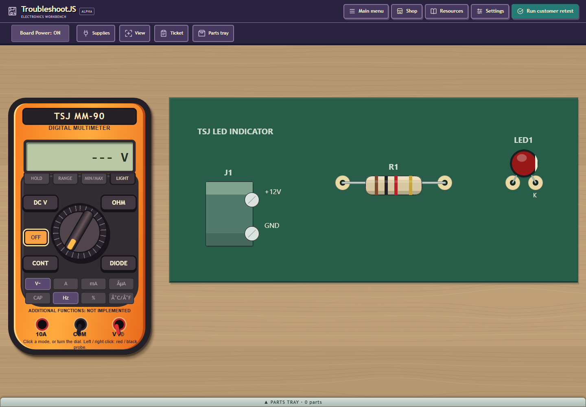
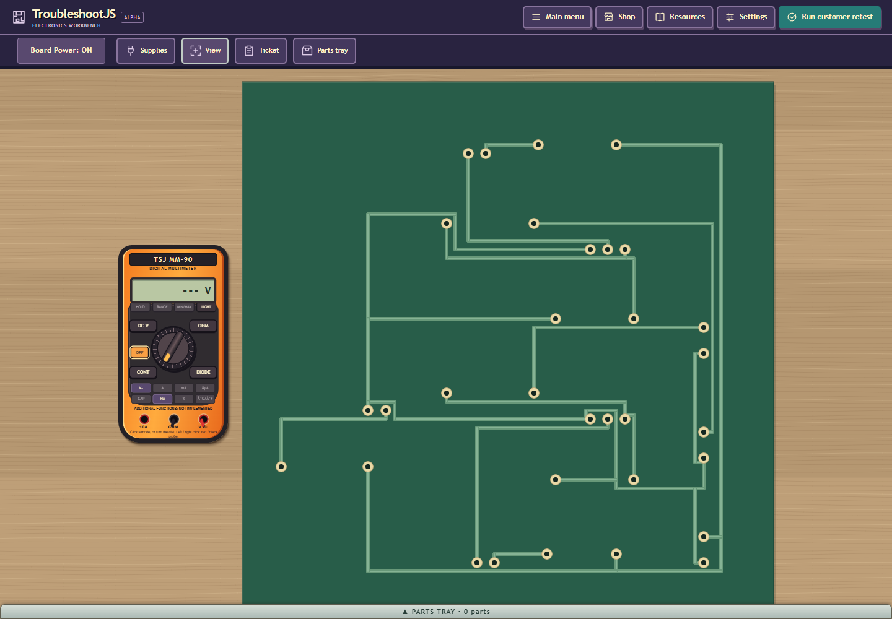

# Q30 current qualification checkpoint

Q30 remains **DISABLED / NOT ACCEPTED**. Fresh gates consumed source commit
`c621b55d2b071e064d5afd383451d2715e35940d`, identity
`87bb04f707ccaf57f92c5d38fdbf4db199d63359c573725fd34bac61484226d7`
(1,355 inputs). A later documentation commit does not change those receipt labels.

Fresh native83 and append26 passed strict audits (3,918.455 s and 192.366 s).
Actual isolated and shipping JDK8/GWT builds passed five permutations each
(82.844 s and 81.496 s). Four actual compiled canaries and original
77-root/308-declaration manifest freeze passed (18.107 s; host cleanup 1.177 s).
Compiled31 passed 31/31 with zero strict errors
(2,944.978 s), including current D01 canaries and the typed seed-35 rejection.
Disabled shipping menu passed 30 launches/two exact replays, stale rejection and
privacy checks (210.132 s). Compiled/menu independent resource release passed;
host cleanup was 1.280/0.569 s, release operations 1.061/0.896 s. Source-only
archive passed (75.878 s); private-enabled archive acceptance was not assessed.
Native/build/archive cleanup clocks were not recorded separately.

The actual serial cold cohort/controller passed 77/77 and exited 0 within the
approved 12:20:46.188302Z-16:32:46.188302Z window. Worst application case was
normal seed 35 at **85.003 s**, 506 units, under unchanged 90 s/640-unit/5 s limits.
Controller operation was 4,440.490 s; recorded cleanup 0 ms is clock granularity.
Outer normal launcher child was PID 17052; serial controller was PID 17304.
Structural/native and developer warm distributions remain descriptive;
normal-player warm reliability is UNMEASURED.

**Independent cold release remains BLOCKED.** Corrected R5 ran once through a
detached observer after real positive/negative Windows lifecycle canaries passed.
It exited 2 after 8,352 ms (observer call 8,461 ms): 806/809 recorded instances
proven absent, three unresolved live images, zero classified complete reuse,
all 77 ports closed, all 77 case cleanups and outer cleanup verified. PIDs 9032,
6540 and 12212 had different same-precision CIM births but unavailable executable
paths. The unchanged strict verifier keeps them unresolved. No process was
terminated, no further release retry is scheduled, and no failure was deleted.
Both detached launcher/observer instances were independently absent. Their
closed receipt/log writes occurred before the deadline. Hard stalled-I/O
termination/watchdog behavior remains NOT_PROVED.

R1-R4 are preserved. R1's host-variable collision preceded OS observation;
separate unsupported New-Item publication failed before its receipt. R2/R3
classifications lack conflicting live tuples, so no precise mismatch is claimed.
R4 records a precise conhost replacement plus an unknown native row erroneously
counted absent; its 809-absence claim is not literal proof. R5 corrects unknown
metadata accounting without weakening the strict zero-reuse/unknown predicate.
The first detached AUDIT launcher was rejected before audit by a premature
parent-PID guard. The correction still requires verified parent exit 0 through
the retained handle, and rejects observer PID overlap. Fresh post-fix canary
and actual audit receipts supersede correction-time NOT_RUN metadata. Both
fresh runs had launcherPidWasRecorded=false: the allowed launcher-PID-overlap
branch was reviewed statically and was NOT_EXERCISED by these native runs.

Private enabled build, menu/replay, role binding and private source archive are
**NOT RUN** because strict cold release is blocked. The local private adapter
now accepts the maintained exact four-key snapshot and verifies snapshot-bound
catalog/layout bytes. Actual positive preflight, five memory-only negatives and
independent final 1,355-input/eight-untracked preservation audits passed. These
are adapter checks, not private menu acceptance.

Fresh visible 20/30/40-part repair QA is **NOT RUN**: no supported Browser or
computer visible-input tool is exposed. Two current headless screenshots below
were inspected for disabled-shipping layout/privacy only. Historical headed
repair evidence and its nine failed actions/readiness limits remain historical;
it has not been relabeled fresh c621b55d input evidence. Parent owns acceptance.

## Retained evidence and restart

`gate-summary.json`, `cold77-summary.json` and `evidence-hashes.json` bind the
portable facts to retained local bytes. Large raw logs, process inventories,
source snapshot and mutable handoff remain local reference-only. No runnable
helper is copied here. Aliases resolve to these task-owned directories:

- N: `epoch15-final/qualification-verifierfix-20261005-r2` under the task workspace.
- W: `epoch15-final`; current live handoff is `q30-qualification-live-handoff.json`.
- T: OS temp `q30-qualification-c621b55d-mcp4z52b`.
- B: OS temp `q30-cold77-owned-batch-a5n_53xu`.
- OBSERVER_CANARY / OBSERVER_AUDIT: OS temp
  `cold77-detached-release-observer-canary-20261005-r2` /
  `cold77-detached-release-observer-audit-20261005-r2`.

Next action is parent review of the strict release prerequisite and fresh
visible-input capability. Do not rerun an unchanged blocked auditor or launch
the private binder. Do not silently replace zero-reuse with exact-instance
absence; that retrospective proposal needs separate scope and real Windows
canaries. Current helper hashes and hard-coded candidate boundary are listed
in `review-only-helper-source-pins.json`. After any documentation commit audit
all consumed src/tests/war/scripts bytes before reuse, and preserve original
receipt commit labels. A new launch needs maintained current binding, not a
fabricated receipt or unchecked metadata substitution.

Once a valid release prerequisite is established, remaining Q30 work is the
private enabled production build/menu/replay, private source archive, supported
visible repair QA and parent acceptance. Public enablement follows acceptance.
U06/U07/Q60 remain unstarted. No push, publication, email, global PC change or
evidence deletion occurred. All eight original untracked files and the Desktop
sibling are preserved. No recorded task-owned expensive gate remains active;
scratch/profiles/raw evidence are retained. This is not a global PC idle claim.

A read-only leaf reviewed the portable packet against completed receipts and
found two metadata/scope gaps. Root corrected both and refreshed the final
59-pin freeze receipt; this review is not Q30 electrical acceptance.

See `retrospective.md` for ranked future simplifications. No proposal there was
implemented in this continuation. Production ownership is unchanged, so
ARCHITECTURE.md needs no update.
