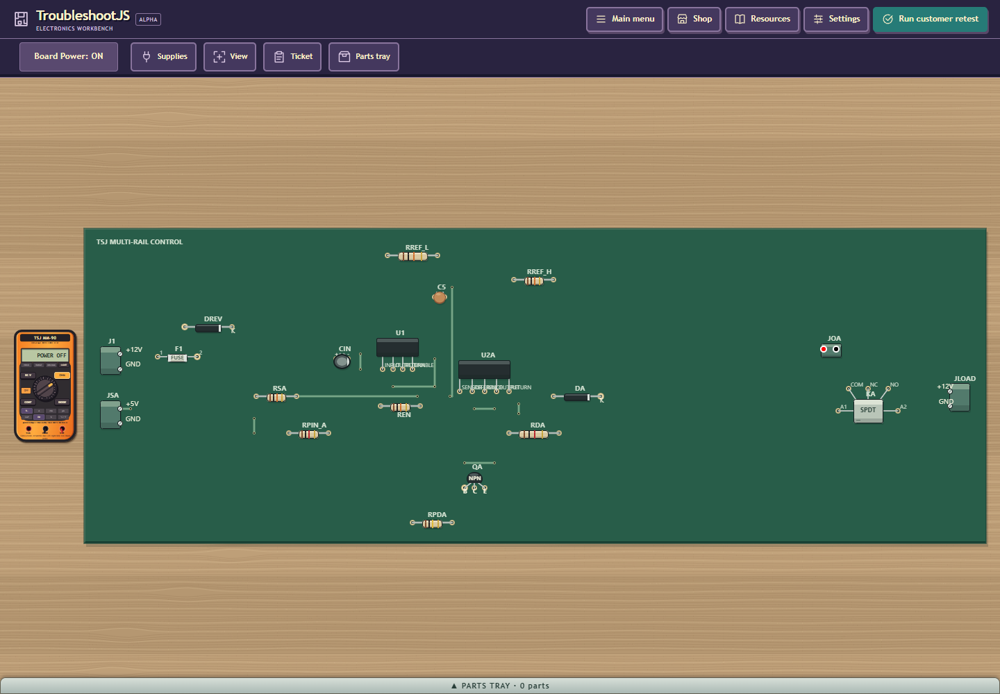
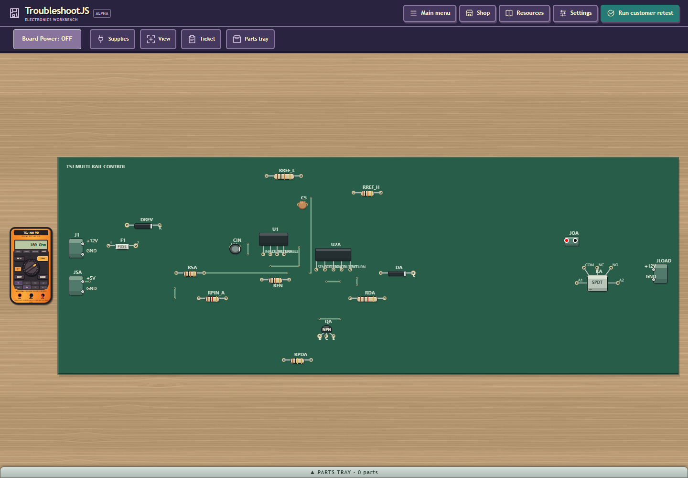
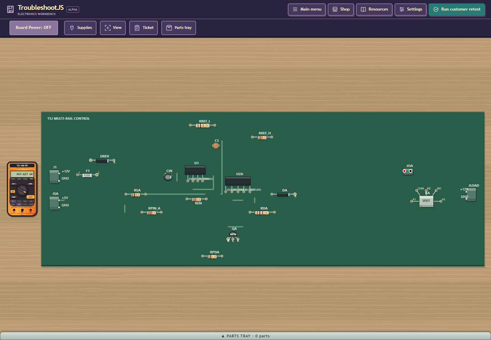

# Q30 targeted discharge and pending-meter fix — local checkpoint

2026-10-05. Q30 remains DISABLED / NOT ACCEPTED. This closes a bounded scheduling
and retry defect; it does not replace the failed cold qualification or certify
30/40-part recovery. No push, publication, email, evidence deletion, budget waiver,
model/solver/threshold/save/replay-format/epoch change, or U06/U07/Q60 work.

Source binding is HEAD `529f42582d903843254fc7cd73624b92eff55bdc` plus the four
declared source/test edits, 1,355 consumed files, identity
`57905b14065949fb7e06af1cd7e6b976af3a6776301ed8c0d65936efe83965b4`. A later local commit can reuse these receipts only after
auditing all consumed bytes unchanged. These commands did not run on a future SHA.

Q30 now advances the same real transient by 5 ms per live frame only when every
actual external source switch is disconnected; powered cadence stays 0.1 ms.
Explicit profiles retain 30 ms and the real adaptive timestep/work limits. The
two fixed intervals enter the immutable temporal dependency. OHM/CONT and DIODE
retry a pending reading on genuine READY with both probes present. Existing
power/readiness/temporary-source/cleanup owners retain authority.

The baseline observation-only JDK8 diagnostic advanced the actual isolated graph
to 20 simulated seconds for seeds 10387/10226/10014, exit 0 / 216.863 s total. Seed
10387 reached READY at the 15-second sample. Seed10226's DREV_OPEN leaves optional
C12 upstream: FUSED12 remained about 12 V at 20 s although RAIL12 fell to 0.129 V.
Seed 10014's REN_OPEN disables the regulator; RAIL12 was 4.652 V at 20 s. Its input
22 uF/1 MOhm path has a 22-second time constant (about 85 seconds to 0.25 V from 12 V,
an estimate, not observed recovery). The ordinary UI keeps advancing when OFF,
but its prior extra 0.1 ms/frame explains why five wall minutes did not establish
enough simulated time. No readiness declaration or stored energy was erased.
DREV has an existing unpowered catalog replacement path; visible repair-to-
readiness for that isolated capacitor is still unproved in this pass.

Final checks:

- PASS: maintained `scripts/verify-current-contracts.ps1`, actual JDK8,
  `-Suite Q30PowerReadinessContractTest,Q30PlanContractTest,A06PowerContractTest,
  U02MeasurementContractTest,U03ObservationContractTest,
  GeneratedExternalPowerBindingsControlObservationContractTest,
  A10DependencyContractTest,Q30TemporalWorkContractTest`; exit 0/
  86.621 s. Separate receipt/source audit PASS.
  Readiness: 144 assertions retains charged negative cases and real OHM/DIODE for
  all three roots. Natural 20-part recovery used 2463 real 5 ms advances, 12.31528 additional
  simulated seconds, 0.249916686 V,179.999999999997 Ohm/0.457627118644 V. Same graph
  and actual source isolation verified. Full matrix/independent oracles NOT RUN
  on this changed candidate; prior 83-suite PASS is bound to abbc614e/49bff752.
- PASS/build-only: actual maintained `scripts/build.ps1 -Target Compile -Style
  OBF -ProcessTimeoutSeconds 900 -JavaHome <pinned JDK8>` in a snapshot-bound
  public-disabled copy: 83.209 s operation, five permutations.
  Private diagnostic build: 83.080 s operation, five permutations.
  Each raw 1355 / compiled 357 / deploy 6/nine pinned jars unchanged before/after;
  bounded child jobs/readers closed, cleanup 0 ms reported separately. Private
  deltas are the catalog toggle plus a read-only CircuitJS snapshot getter;
  neither is present in tracked/public production.
- PASS/targeted 20-part only: actual headed Edge/ordinary Playwright UI, 44/44 actions,
  no page errors. Fixed left-red/right-black JOA probes: powered POWER OFF,
  charged-off DISCHARGE, automatic 180 Ohm after 120.798 s and
  457.627 mV after 120.654 s. No mode/probe/power/reset/mutation
  or injected solver advance between blocked and numeric reading. Later actual
  READY samples retained source isolation and RAIL12 0.12042/0.08063 V. Clicking
  active DIODE again exited; board stayed OFF. Four screenshots inspected below.
  Built-in Browser unavailable; SDK input is not CDP-wrapper or blind-diagnosis
  certification. `page.evaluate` called only the private read-only getter.
- PASS/release-only:12 recorded diagnostic/native/build owners absent; final
  headed 17 recorded instances absent/port 57359 closed. First headed attempt 16
  instances absent/port 51500 closed. Audits were read-only, no termination.
  Final UI controller's pre-exit console and terminated preview exit 1 remain
  recorded separately; driver exit 0 and independent release PASS do not recast
  that preview exit as 0. Final preview/query cleanup 0.645 s; browser-context close
  and native cleanup durations were not separately recorded. Scratch, browser
  profiles, copied sources/classes and all raw evidence are retained.

Read-only leaf diff review found a READY/no-probe refresh edge; the final guard
requires both probes and review found no remaining blocker. Review ran no gates.
Another leaf rechecked seed 10014 report/receipt hashes: historical 75.535 s,
current focused eight-suite9.195 s with equal 440 units/390 proof units and matching proof
program/partition/evidence; hypothesis time increased 13.234 s. Current cold run
still TIMEOUT 90.621 s/435 units. Power metadata adds 204 context characters, but
there is no demonstrated 13-second code cause. Current repeat variation is about
1.4 s; the historical resource sample is not contemporaneous. Host attribution
remains unresolved; no performance fix or cohort rerun was justified.

Preserved limitations/failures: first prepare failed due task-temp sandbox write;
first discharge fixture failed STALE_OWNER because its off switch required fresh
analysis (correct guard; corrected fixture only). A public-build image canary
rejected the runtime-wrapper Python before spawning GWT; exact physical Python
passed. A first 26-action headed run was stopped at 7.119 simulated seconds/0.466 V
to fix the no-probe edge; it is DISCHARGE, not recovery. In the final ledger the
early filename `003-final20-ohm-ready.png` still shows DISCHARGE; it is excluded
from inspected recovery evidence. All attempts are retained, not blessed as PASS.

Remaining: parent-controlled new-source full77 and timing attribution, full native
matrix/compiled canaries, normal warm distribution, qualified menu/replay, visible
30/40 repair-to-readiness, source archive verification, public enablement/build
only after every acceptance gate, and independent parent review. U06/U07/Q60
remain unstarted. The 90,000 ms/640 shared/5,000 ms active limits are unchanged.

The 167-member `targeted-evidence.tar.gz` is an evidence packet, not the maintained
source-archive acceptance gate. SHA256 `386c4c823ecbf08540690e7d95f8551ce290482545772a2890a22640fc00c936`. `packet-audit.json`
checks every bounded regular member/roundtrip and records raw/portable hashes.
Known personal roots are replaced by task tokens; listed credential-pattern scan
passed (not comprehensive). Original raw artifact paths and restart callers are
in the external task handoff. Eight pre-existing untracked files and the Desktop
sibling are preserved. Local commit only.

